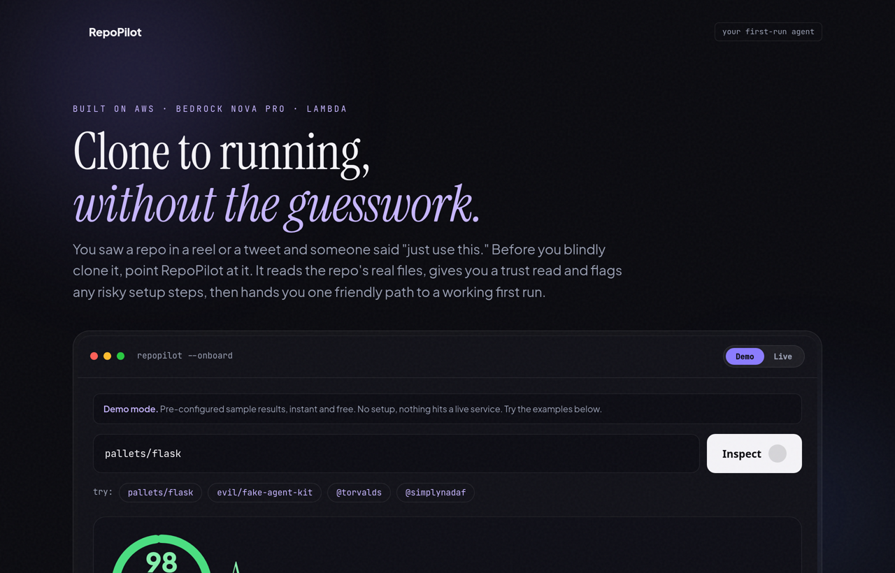
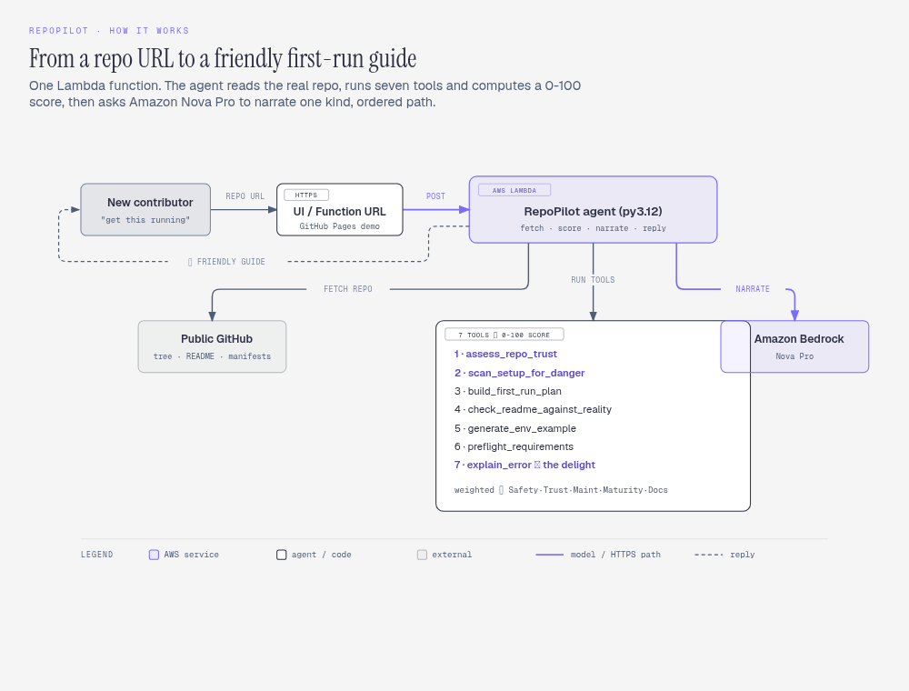

<div align="center">

# 🧭 RepoPilot: Your First-Run Agent (2026)

### Point it at any public GitHub repo and it computes a **0-100 RepoPilot Score** (is this repo safe to trust and run?), flags **dangerous setup steps** and **critical issues**, then hands a brand-new contributor **one accurate path from clone to a working first run**. Point it at a **username** instead and it profiles the developer: bio, footprint, and top repos ranked by stars. When a command fails, it explains the error like a patient teammate instead of dumping a stack trace.

[](https://aws.amazon.com/lambda/)
[](https://aws.amazon.com/bedrock/)
[](https://aws.amazon.com/ai/generative-ai/nova/)
[](https://strandsagents.com)
[](LICENSE)

[](https://youtu.be/CZXNQrqXG7I)

[](https://youtu.be/CZXNQrqXG7I)
[](https://simplynadaf.github.io/repopilot-your-first-run-agent/)
[](https://builder.aws.com/content/3KSGqk5omLzBXfpe6VIOritaAQn/score-any-github-repo-0-100-before-you-clone-it-an-aws-ai-agent)

**🏗️ Built for the [AWS Builder Center "Build an Agent" Weekend Challenge](https://builder.aws.com/content/3KSGqk5omLzBXfpe6VIOritaAQn/score-any-github-repo-0-100-before-you-clone-it-an-aws-ai-agent) · #agents**

⭐ If RepoPilot saved you from a painful first run, give it a star. It helps other builders find it.

[The Problem](#-the-problem) • [What It Does](#-what-it-does) • [Architecture](#-how-it-works) • [Getting Started](#-getting-started) • [FAQ](#-faq)

</div>

---

**📖 Table of Contents**
- [The Problem](#-the-problem)
- [What It Does (7 tools)](#-what-it-does)
- [The RepoPilot Score](#-the-repopilot-score)
- [The Delightful Detail](#-the-delightful-detail)
- [How It Works](#-how-it-works)
- [Tech Stack](#️-tech-stack)
- [Prerequisites](#-prerequisites)
- [Getting Started](#-getting-started)
- [Try the Live Demo](#️-try-the-live-demo)
- [Proof It Works](#-proof-it-works)
- [Project Structure](#-project-structure)
- [Least-Privilege IAM](#-least-privilege-iam)
- [An Honest Take](#-an-honest-take)
- [FAQ](#-faq)
- [License](#-license)

---

## 🤔 The Problem

You just got access to a repo. You clone it, and you are staring at a folder full of strangers. What now?

The honest answer is that the setup path is **not in one place**. It is scattered across the README, the `package.json` scripts, the CI config, a `.env.example`, a few old pull requests, and whatever the maintainer happens to remember. The repo has a working state, but [that state is "not fully captured anywhere."](https://otaready.hashnode.dev/why-working-repos-still-fail-new-contributors)

And the README? [READMEs decay and lie](https://medium.com/@devcommando/the-first-five-minutes-in-a-new-codebase-decide-whether-you-become-useful-in-a-week-or-a-quarter-1be1f119e5e4). The person who wrote it left, the diagram predates a migration nobody updated. So you follow it, hit an error, and now [the clock starts ticking](https://www.daytona.io/dotfiles/the-hidden-cost-of-broken-dev-environments): minutes become hours in config files and Stack Overflow tabs.

> **RepoPilot is a working agent that attacks exactly these pains.** You give it a public repo; it reads the *real* files, hands you one ordered path to a running project, flags where the README disagrees with reality, and turns your first error into a plain-English next step. Deployed on AWS Lambda, reasoning with Amazon Nova Pro on Bedrock.

### Why this matters more in 2026

You do not just inherit repos at work anymore. You see one in a reel or a tweet, someone says *"just use this repo for agents,"* and you blindly clone the URL. Attackers know this. In 2026 the **FakeGit / AgentBaiting** campaign planted [more than 17,000 malicious GitHub repos](https://www.bleepingcomputer.com/news/security/fakegit-malware-campaign-returns-with-17-610-malicious-github-repos/) that [pose as AI agent, MCP, and skill repos](https://www.island.io/blog/agentbaiting-how-800-fake-ai-skills-and-mcp-servers-delivered-malware), using copied code and convincing READMEs, with an install step that drops an infostealer after your AWS keys and sessions. Related worms steal AWS Secrets Manager credentials across regions.

So before RepoPilot helps you *run* a repo, it helps you decide whether you should *trust* it. That is the first thing it shows you.

---

## 🤖 What It Does

> One agent. Seven tools. Every tool removes a documented onboarding or safety pain.

| 🛠️ Tool | What it does | Pain it kills |
|---|---|---|
| 🛡️ `assess_repo_trust` | Reads repo age, star timing, maintenance, license, owner, gives a plain-language trust grade + flags | Blindly trusting a repo from a reel |
| ⚠️ `scan_setup_for_danger` | Scans README + install scripts for `curl \| bash`, postinstall hooks, base64 blobs, raw-IP calls | Hidden malware in the setup step |
| 🧭 `build_first_run_plan` | Reads the file tree + README + manifests, emits **one ordered path** from clone to run | Scattered setup |
| 🔎 `check_readme_against_reality` | Flags commands/files the README references that **don't exist** in the repo | READMEs that lie |
| 📝 `generate_env_example` | Produces a filled `.env.example` with safe placeholders + a hint per variable | Env misconfiguration |
| ✅ `preflight_requirements` | Extracts required tool versions (node engine, python, go) so you check **up front** | Env drift / "works on my machine" |
| 💬 `explain_error` | Parses a failing command's output → plain-language cause + the one next step | The ticking-clock error ★ |

The agent runs the safety tools first, then the first-run tools, then asks **Amazon Nova Pro** to narrate the result in a warm, concise voice. The order matters: you see "should I trust this?" before "how do I run it?"

---

## 📊 The RepoPilot Score

Every inspection produces a single **0-100 score**, computed like a credit score: a weighted
average of five dimensions, each scored from real signals in the repo's metadata and files.
Every point is traceable, and the result lists exactly what helped and what hurt.

| Dimension | Weight | Driven by |
|---|---|---|
| 🛡️ Safety | 30% | Dangerous setup steps (`curl \| bash`, postinstall hooks, base64 blobs, raw-IP calls) |
| 🔐 Trust | 25% | Fake-star mismatch (new repo + huge star count), owner signals |
| 🔧 Maintenance | 20% | Last-push recency, archived flag, open-issue ratio |
| 📈 Maturity | 15% | Age, genuine stars, forks |
| 📚 Documentation | 10% | README depth, license, `.env.example`, tests |

**Grades:** 90+ `A` Excellent · 75+ `B` Good · 60+ `C` Caution · 40+ `D` Risky · <40 `F` Avoid.

A **critical safety issue caps the overall grade** (just like a default caps a credit score),
because "it runs fine" means nothing if the setup step is designed to steal your keys. Critical
issues are surfaced first, ranked by severity (`CRITICAL` / `HIGH` / `MEDIUM`), each with its
exact point impact.

> Example: the Flask repo scores **98/100 (A, Excellent)**: Safety 100, Trust 100, Maintenance
> 100, Maturity 100, Documentation 85. A repo with a `curl \| bash` installer and 40,000 stars on
> a 20-day-old account is capped at **32/100 (F, Avoid)** with two `CRITICAL` flags.

### Two modes, one agent

The input is overloaded. Give RepoPilot an **`owner/repo`** and it inspects and scores the repo.
Give it a bare **username** (like `torvalds`) and it switches to **developer-profile mode**: the
person's bio, how long they have been active, their total stars, main languages, and their top
repositories ranked by stars and forks, with a short credibility read. The same "do not blindly
trust what a reel told you" logic, applied to the person as well as the repo.


The challenge's own example of a delightful experience is *"a helpful error message."* So that is where RepoPilot spends its care: **the first failure.**

When your first `pip install` or `npm start` explodes, RepoPilot does not echo the red wall. It responds like a teammate leaning over:

```
$ pip install -r requirements.txt
  ERROR: ModuleNotFoundError: No module named 'flask'

🧭 RepoPilot:
   Cause : A dependency the code imports hasn't been installed.
   Fix   : Run the install step again in the right environment
           (activate your venv first for Python).
   "You're close. This is a common first-run snag, not something you broke."
```

**How we know it worked:** the metric that onboarding teams actually track is [time-to-first-successful-run](https://recruiter.daily.dev/resources/developer-onboarding-first-90-days-playbook-engineering-teams/). RepoPilot's job is to collapse it, and to make the moment a command fails the moment you feel *helped*, not stuck.

---

## 🧠 How It Works



<details>
<summary><b>Text version of the diagram</b></summary>

```
 🧑 You                     ☁️ AWS Lambda (python3.12)              🧠 Amazon Bedrock
 ┌────────────────┐  POST  ┌──────────────────────────────┐  narrate ┌──────────────┐
 │ owner/repo     │ ─────▶ │  RepoPilot agent              │ ───────▶ │  Nova Pro    │
 │  or a username │        │  fetch · score · narrate       │ ◀─────── │              │
 └───────▲────────┘        │                                │          └──────────────┘
         │                 │   7 tools  →  0-100 score:      │
         │ score + guide   │   1 assess_repo_trust           │   🐙 Public GitHub
         │  (or profile)   │   2 scan_setup_for_danger       │◀──────── tree · README ·
         └─────────────────│   3 build_first_run_plan        │          manifests · meta
                           │   4 check_readme_against_reality│
                           │   5 generate_env_example        │
                           │   6 preflight_requirements      │
                           │   7 explain_error  ★ the delight│
                           └────────────────────────────────┘
     weighted: Safety 30 · Trust 25 · Maintenance 20 · Maturity 15 · Docs 10
```
</details>

The whole agent lives in one Lambda function. It fetches the public repo with the Python standard library (no third-party deps in the package), runs the seven pure-Python tools to produce deterministic facts, then makes a **single Amazon Nova Pro call** to turn those facts into a kind, ordered guide. If the model is ever unavailable, the deterministic plan is still returned, so the agent never dead-ends.

---

## 🛠️ Tech Stack

| Component | Technology |
|---|---|
| 🤖 Agent loop | [Strands Agents SDK](https://strandsagents.com) (local CLI) + a self-contained Bedrock loop (Lambda) |
| 🧠 Model | [Amazon Nova Pro](https://aws.amazon.com/ai/generative-ai/nova/) (`amazon.nova-pro-v1:0`) via Amazon Bedrock |
| ☁️ Compute | [AWS Lambda](https://aws.amazon.com/lambda/) (python3.12) + Function URL |
| 🐙 Source read | Public GitHub REST API via Python stdlib (`urllib`), zero vendored deps |
| 🐍 SDK | Python 3.10+, `boto3` (provided by the Lambda runtime) |
| 🎨 Frontend | Single-file HTML/CSS, premium dark glass UI, graceful offline fallback |

---

## 📋 Prerequisites

| # | Requirement | Details |
|---|---|---|
| 1 | **Python 3.10+** | `python3 --version`. (The pure-Python tools and offline CLI also run on 3.9.) |
| 2 | **AWS credentials** | With `bedrock:InvokeModel` for Nova Pro. The ready policy ships at [`iam/bedrock-invoke-policy.json`](iam/bedrock-invoke-policy.json). |
| 3 | **Amazon Nova Pro** | Enable model access in the Bedrock console (`us-east-1`) → *Model access* → `amazon.nova-pro-v1:0`. This is a Bedrock grant, not an IAM permission. |

> ⚠️ **Nova Pro needs both:** (a) **model access** enabled once in the Bedrock console, and (b) the **`bedrock:InvokeModel`** permission in the IAM policy. Without (a) you get `AccessDenied` on the first call, and no policy can fix it.

### 🔑 Enabling Amazon Nova Pro for Live mode (step by step)

Amazon Nova does not use a simple API key. "Keys" here means **AWS credentials** plus a
**one-time Bedrock model-access grant**. Do this once:

**1. Get AWS credentials (your "keys")**
```bash
aws configure
# AWS Access Key ID:     <from IAM console → Users → Security credentials>
# AWS Secret Access Key: <shown once when you create the access key>
# Default region name:   us-east-1
# Default output format:  json
```
These are stored in `~/.aws/credentials`. RepoPilot (CLI and the deploy script) reads them automatically.

**2. Turn on Nova Pro in Bedrock (the one step no key can replace)**
- Open the **Amazon Bedrock console** in **us-east-1**.
- Left nav → **Model access** → **Manage model access**.
- Tick **Amazon → Nova Pro** (`amazon.nova-pro-v1:0`) → **Save changes**.
- Access is usually granted in under a minute. Without this, every call returns `AccessDenied`.

**3. Give the running identity permission to invoke it**
- Attach the ready-made least-privilege policy [`iam/bedrock-invoke-policy.json`](iam/bedrock-invoke-policy.json) to your user or the Lambda role (the `make deploy` script does this for the Lambda automatically).

**4. (Optional) point the model id / region**
- Defaults are `amazon.nova-pro-v1:0` and `us-east-1`. To change, set `REPOPILOT_MODEL_ID` and
  `AWS_REGION` in `.env` (you can switch to `amazon.nova-lite-v1:0` for a cheaper, faster model).

**5. Verify your keys work before anything else**
```bash
aws bedrock-runtime converse \
  --region us-east-1 --model-id amazon.nova-pro-v1:0 \
  --messages '[{"role":"user","content":[{"text":"say hello"}]}]' \
  --inference-config '{"maxTokens":20}'
# A JSON reply = your credentials + Nova Pro access are good to go.
```

Now `make run-ai REPO=pallets/flask` (CLI) or Live mode in the web UI will hit real Nova Pro.

---

## 🚀 Getting Started

```bash
git clone https://github.com/simplynadaf/repopilot-your-first-run-agent.git
cd repopilot-your-first-run-agent

make setup                 # venv (py3.10+) + deps + copies .env.example -> .env
make test                  # run the 25 unit tests (tools + score, no AWS needed)

# Inspect + score a repo with the deterministic tools (no model call, works offline):
make run REPO=pallets/flask

# Inspect with the full Bedrock Nova Pro agent (needs AWS creds + Nova Pro access):
make run-ai REPO=pallets/flask AWS_REGION=us-east-1

# Profile a developer instead of a repo (just pass a username):
python3 -m repopilot.cli torvalds
```

Run `make help` for every target.

> **Optional:** set `GITHUB_TOKEN` (or `GH_TOKEN`) in your environment to raise GitHub's API
> limit from 60 to 5000 requests/hour. RepoPilot works without it; the token just helps under
> heavy use.

<details>
<summary><b>Prefer manual steps?</b></summary>

```bash
python3 -m venv .venv && . .venv/bin/activate
pip install -r requirements.txt
python3 tests/test_tools.py && python3 tests/test_score.py   # 25 passing
python3 -m repopilot.cli pallets/flask --offline # repo inspection, deterministic
python3 -m repopilot.cli pallets/flask           # repo inspection, Strands + Nova Pro
python3 -m repopilot.cli torvalds                # developer profile mode
```
</details>

### Deploy it to AWS Lambda

```bash
make deploy                # builds the zip, creates the role + function, updates code
```

---

## 🖥️ Try the Live Demo

The hosted UI ([`ui/index.html`](ui/index.html), also on GitHub Pages) has two modes, toggled top-right:

- **🎮 Demo mode (default):** instant, pre-configured results. Zero setup, nothing hits a live
  service, never breaks. Try `pallets/flask` (scores A), `evil/fake-agent-kit` (a crafted
  malicious repo that scores F with critical flags), `@torvalds`, or `@simplynadaf`.
- **⚡ Live mode:** calls the real deployed agent (API Gateway → Lambda → Amazon Nova Pro). Any
  repo or username returns live data. No key needed from the visitor; it runs on the project
  owner's AWS account. First call after idle has a short Lambda cold start.

### Run Live on your own AWS account

Prefer not to use the hosted endpoint? Stand up your own in a few minutes. Here is exactly what
you need and where each piece is configured.

**What you need**
1. An **AWS account** with the **AWS CLI** installed and configured (`aws configure`).
2. **Amazon Nova Pro model access**, enabled once in the **Bedrock console** (`us-east-1`) →
   *Model access* → enable `amazon.nova-pro-v1:0`. This is a Bedrock grant, not an IAM permission,
   so no policy can do it for you.
3. **Python 3.10+** (only to run the CLI; the Lambda uses the managed `python3.12` runtime).

**Where to configure things**

| Thing | Where | Note |
|---|---|---|
| AWS credentials | `~/.aws/credentials` (via `aws configure`) | Needs `lambda:*`, `iam:CreateRole`, `bedrock:InvokeModel` to deploy |
| Nova Pro access | Bedrock console → Model access | One-time, per region |
| Model + region | `.env` (`REPOPILOT_MODEL_ID`, `AWS_REGION`) | Defaults to `amazon.nova-pro-v1:0` / `us-east-1` |
| GitHub rate limit (optional) | `.env` → `GITHUB_TOKEN` | Raises 60 → 5000 req/hour |
| Live endpoint for the UI | `ui/index.html` → `const ENDPOINT` | Paste your API Gateway or Function URL here |

**Steps**
```bash
# 1. Clone + install
git clone https://github.com/simplynadaf/repopilot-your-first-run-agent.git
cd repopilot-your-first-run-agent && make setup

# 2. Deploy the Lambda (creates the IAM role + function, uploads the code)
make deploy                      # uses your AWS CLI creds; region from $AWS_REGION

# 3. (For a public web UI) put an HTTP API Gateway in front of the Lambda:
API_ID=$(aws apigatewayv2 create-api --name repopilot-api --protocol-type HTTP \
  --target arn:aws:lambda:us-east-1:<ACCOUNT_ID>:function:repopilot \
  --cors-configuration AllowOrigins="*",AllowMethods="POST,OPTIONS",AllowHeaders="content-type" \
  --query ApiId --output text)
aws lambda add-permission --function-name repopilot --statement-id apigw \
  --action lambda:InvokeFunction --principal apigateway.amazonaws.com \
  --source-arn "arn:aws:execute-api:us-east-1:<ACCOUNT_ID>:$API_ID/*/*"
echo "Your endpoint: https://$API_ID.execute-api.us-east-1.amazonaws.com"

# 4. Paste that endpoint into ui/index.html -> const ENDPOINT, open the file, pick Live.
```

Prefer the terminal? Skip the web UI entirely and just run `make run-ai REPO=pallets/flask` or
`python3 -m repopilot.cli torvalds`.

---

## ✅ Proof It Works

Verified against real repos with a real Amazon Nova Pro call:

```bash
$ aws lambda invoke --function-name repopilot --region us-east-1 \
    --cli-binary-format raw-in-base64-out \
    --payload '{"body":"{\"repo\":\"pallets/flask\"}"}' out.json && cat out.json
```

RepoPilot fetched Flask (236 files), scored it **98/100 (A, Excellent)** across the five dimensions, detected the Python stack, read `python >=3.11` from the real `pyproject.toml`, and Nova Pro returned a guide that leads with the score and then the ordered first-run steps. All 23 unit tests (tools + score engine) pass locally and in CI.

---

## 📁 Project Structure

```
repopilot-your-first-run-agent/
├── README.md
├── LICENSE                      # Apache-2.0
├── Makefile                     # setup / test / run / run-ai / deploy
├── requirements.txt
├── lambda_handler.py            # self-contained Bedrock (Nova Pro) handler for Lambda
├── repopilot/
│   ├── tools.py                 # the 7 pure-Python tools (unit-tested)
│   ├── score.py                 # the 0-100 RepoPilot Score engine (weighted dimensions)
│   ├── github.py                # stdlib GitHub fetch -> RepoSnapshot (no deps)
│   ├── agent.py                 # Strands + Nova Pro loop + deterministic fallback
│   └── cli.py                   # the friendly first-run CLI
├── tests/
│   ├── test_tools.py            # tool tests
│   └── test_score.py            # score-engine tests (23 total, no AWS needed)
├── iam/
│   └── bedrock-invoke-policy.json  # least-privilege Nova Pro invoke
├── scripts/
│   └── deploy.sh                # build + deploy the Lambda (reproducible)
├── ui/
│   └── index.html               # premium single-file demo UI
└── docs/
    └── architecture.html        # the How It Works diagram (source for architecture.png)
```

---

## 🔐 Least-Privilege IAM

The agent's only non-read action is `bedrock:InvokeModel` scoped to Nova Pro. The deployment role gets just that plus basic Lambda logging. Policy ships at [`iam/bedrock-invoke-policy.json`](iam/bedrock-invoke-policy.json).

---

## 🧾 An Honest Take

Grounded in actually building and deploying this, not a marketing page.

**What's genuinely good**
- The pure-Python tools are deterministic and unit-tested, so the agent's facts are trustworthy and the single Nova Pro call only handles *tone*, not correctness.
- Dropping `requests` for the stdlib made the Lambda package 13KB and killed a Python-3.9-vs-3.12 dependency clash. Fewer deps, fewer surprises.
- The offline fallback means a demo never dead-ends on a network or credentials hiccup.

**Where it made us work / honest limits**
- Public Lambda **Function URLs can be blocked at the account level** (SCP / public-access setting). If yours is, invoke the function directly or front it with API Gateway. The agent is identical either way.
- The error-recovery tool recognizes the **common** first-run errors by pattern; anything unrecognized is handed to the model with a kind "let's figure it out together" message rather than a false fix.
- README-vs-reality is heuristic (it checks for referenced files/commands), not a full build, so it catches the frequent drift, not every possible lie.

---

## ❓ FAQ

**Is this a real agent or just a prompt?**
Real agent. It calls tools that read the actual repo and reason over the result, then uses the model only to narrate. The logic lives in code, not a prompt.

**Does it need a paid anything?**
No. It runs on AWS Free Tier (Lambda + Bedrock Nova Pro, pennies per run). The tools and offline CLI run with no AWS at all.

**What AWS services does it use?**
Amazon Bedrock (Amazon Nova Pro) for reasoning, and AWS Lambda + Function URL for the deployed, callable agent.

**Can it break my machine?**
No. RepoPilot only *reads* public repos and *suggests* commands. It never runs anything on your machine.

---

## 📝 License

Apache-2.0. See [LICENSE](LICENSE).

---

<div align="center">

## 👨‍💻 Author

**Sarvar Nadaf** · Cloud Architect · AI Infrastructure & DevOps

[LinkedIn](https://www.linkedin.com/in/sarvar04/) · [GitHub](https://github.com/simplynadaf) · [Dev.to](https://dev.to/sarvar_04) · [YouTube](https://www.youtube.com/@sarvar-nadaf) · [AWS Builder Center](https://builder.aws.com/community/@sarvar)

**If RepoPilot gave you a calmer first run, consider a ⭐**

*Built with 💜 on AWS: Strands · Amazon Nova Pro · AWS Lambda*

</div>
